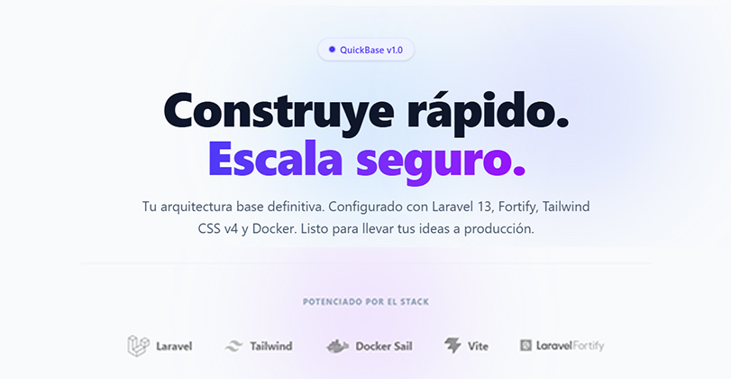

**QuickBase** es un *boilerplate* de nivel de producción estructurado para escalar. Diseñado para saltarse la tediosa configuración inicial y empezar a programar la lógica de negocio desde el primer minuto. 

Proporciona una base sólida con autenticación *headless*, seguridad robusta, borrado lógico de datos y una UI moderna impulsada por componentes.

---

## 🛠️ Stack Tecnológico

*   **Framework:** Laravel 13
*   **Autenticación:** Laravel Fortify (Headless Auth)
*   **Frontend:** Tailwind CSS v4 + Vite
*   **Infraestructura:** Docker & Laravel Sail
*   **Arquitectura de Vistas:** Blade Components (Componentes anónimos)

---

## ✨ Características Implementadas

### 🔒 Seguridad y Autenticación (Fortify)
*   **Flujo Completo:** Registro, Inicio de Sesión y Restablecimiento de Contraseñas (`/forgot-password` y `/reset-password`) gestionados de forma nativa y segura.
*   **Redirecciones Inteligentes:** Configuración personalizada para redirigir correctamente a los usuarios al `/dashboard` evitando el clásico error de enrutamiento a `/home`.

### 👤 Gestión Avanzada de Perfiles
*   **Panel de Configuración (`/profile`):** Interfaz modular para actualizar la información pública del usuario y cambiar su contraseña.
*   **Eliminación Segura (Security Checkpoint):** Proceso de eliminación de cuenta validado por contraseña en el mismo controlador para evitar conversiones HTTP (GET/DELETE).
*   **Borrado Lógico y Ofuscación:** Implementación de `SoftDeletes` en la base de datos. Al eliminar una cuenta, el sistema ofusca el correo electrónico (ej. `timestamp_correo@email.com`) liberando el original para futuros registros sin romper la integridad referencial.

### 🎨 Diseño y UI Moderna
*   **Tailwind v4 Native:** Configuración modernizada utilizando inyección directa `@plugin "@tailwindcss/forms"` sin necesidad del antiguo archivo `tailwind.config.js`.
*   **Componentes SVG Escalables:** Iconografía compleja (multicapa) organizada en Componentes Anónimos de Blade (`<x-svg.laravel />`) para mantener un código limpio y altamente reutilizable.
*   **Landing Page Dinámica:** Vista `welcome` con animaciones CSS (Abstract blobs) y diseño orientado a conversión SaaS.

### 🌐 Localización (i18n)
*   **100% en Español:** Archivos de idioma nativos de Laravel publicados y traducidos. Manejo perfecto de atributos para validaciones amigables (ej. "El campo correo electrónico es obligatorio").

---
## 🗄️ Gestión de Base de Datos (DbGate)

Para facilitar el desarrollo, este boilerplate incluye [DbGate](https://dbgate.org/), un cliente de bases de datos inteligente y basado en web, ya integrado en los servicios de Docker. No necesitas instalar ningún gestor local.

Para visualizar y administrar tu base de datos:

1. Asegúrate de tener los contenedores corriendo.
2. Abre tu navegador e ingresa a: **`http://localhost:3001`**
3. Añade una nueva conexión en DbGate utilizando las credenciales internas de la red de Docker (Sail):
   * **Database Type:** `MySQL`
   * **Server:** `mysql` *(Es el nombre del contenedor, no uses localhost)*
   * **User:** `sail`
   * **Password:** `password`
   * **Database:** `quickbase` *(o el valor de DB_DATABASE en tu .env)*

> **Nota:** Este servicio está configurado para reiniciarse automáticamente y guarda tus conexiones en un volumen dedicado (`sail-dbgate`) para que no las pierdas al apagar los contenedores.

---

## ⚙️ Requisitos Previos

Para ejecutar este proyecto de forma nativa con Docker, necesitas tener instalado:
*   [Docker Desktop](https://www.docker.com/products/docker-desktop/)
*   [Git](https://git-scm.com/)

---

## 🚀 Instalación y Configuración Paso a Paso

**1. Clonar el repositorio**
```bash
git clone [https://github.com/Carlos-MKR/quickbase.git](https://github.com/Carlos-MKR/quickbase.git)
cd quickbase
```

**2. Instalar dependencias de PHP usando un contenedor temporal**
```bash
    docker run --rm \
    -u "$(id -u):$(id -g)" \
    -v $(pwd):/var/www/html \
    -w /var/www/html \
    laravelsail/php8.3-composer:latest \
    composer install --ignore-platform-reqs

Para PowerShell (Windows)
    docker run --rm `
    -u "$(id -u):$(id -g)" `
    -v "${PWD}:/var/www/html" `
    -w /var/www/html `
    laravelsail/php8.3-composer:latest `
    composer install --ignore-platform-reqs

Para Símbolo del Sistema / CMD (Windows)
    docker run --rm ^
    -u "%uid%:%gid%" ^
    -v "%cd%:/var/www/html" ^
    -w /var/www/html ^
    laravelsail/php8.3-composer:latest ^
    composer install --ignore-platform-reqs
```

**3. Configurar variables de entorno**
```bash
cp .env.example .env
```
**4. Levantar los contenedores de Docker (Sail)**
```bash
./vendor/bin/sail up -d
```

**5. Generar la clave de la aplicación y ejecutar migraciones**

```
./vendor/bin/sail artisan key:generate
./vendor/bin/sail artisan migrate
```

**6. Compilar los assets del frontend**
```
./vendor/bin/sail npm install
./vendor/bin/sail npm run dev
```

¡Listo! Tu aplicación estará corriendo en http://localhost
